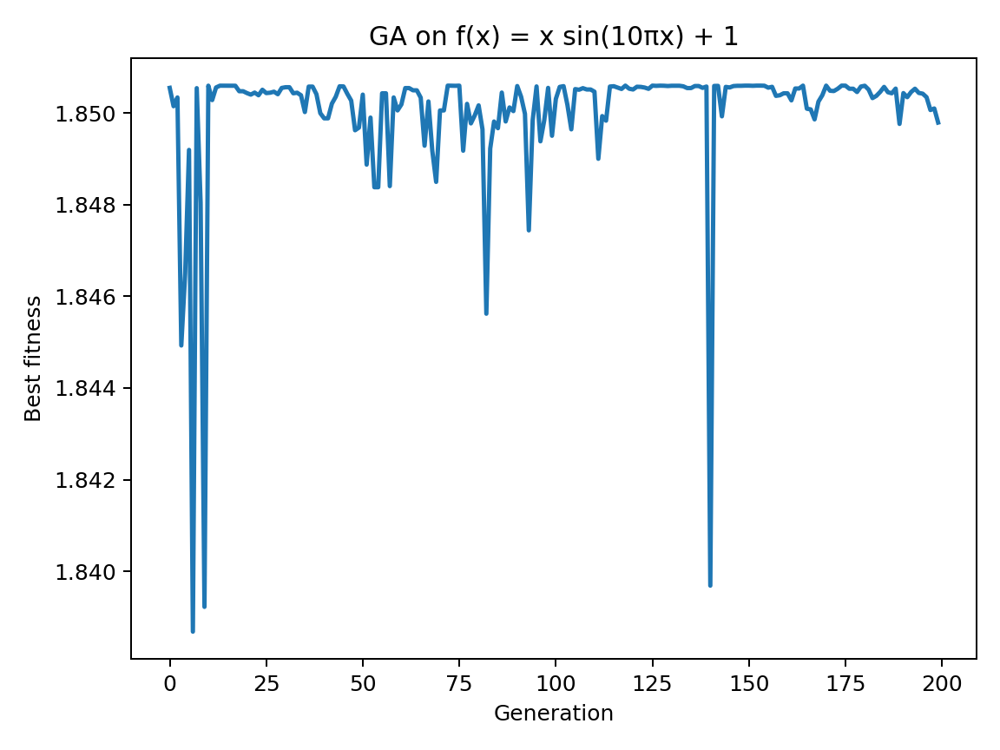
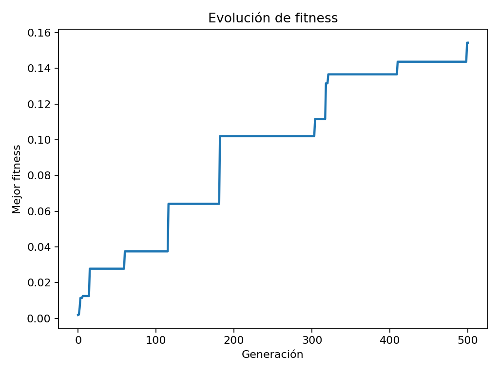
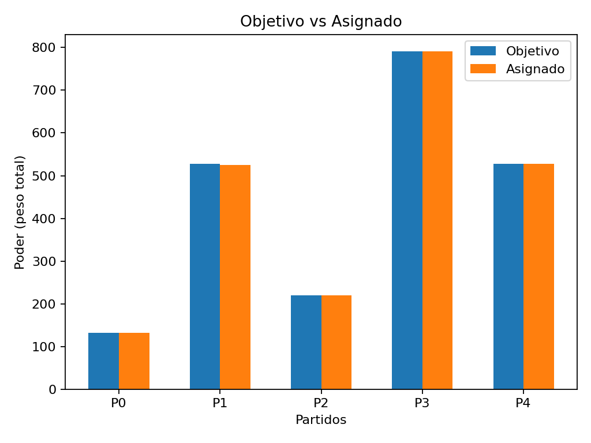
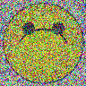
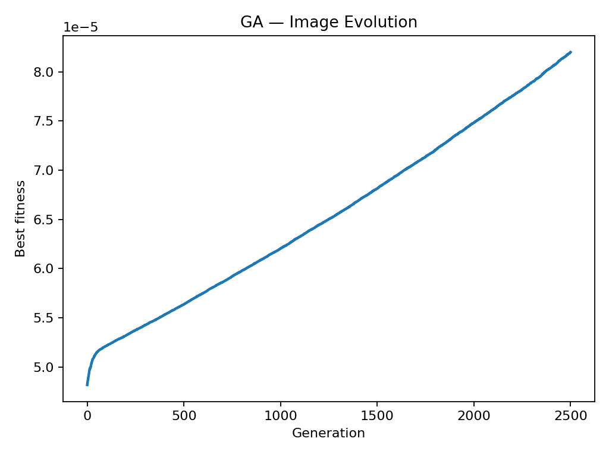

#  3. Algoritmo_genetico - ia y minirobots 

Juan David Meza  
Andres Avílan

## Ejercicio 1 — Maximize f(x) = x·sin(10πx) + 1 (x ∈ [0, 1])

Este repositorio contiene una implementación *desde cero* de un **Algoritmo Genético (AG)** para **maximizar**
\( f(x) = x\sin(10\pi x) + 1 \) con \( x \in [0,1] \). Se usa un **AGS** (Algoritmo Genético Simple) con **codificación binaria**, **selección por ruleta**, **cruce en un punto** y **mutación por volteo de bit** — los mismos operadores vistos en clase.

> Contexto y formulación del ejercicio están en el material del curso (sección *Ejercicios y Problemas*). En particular, el **Ejercicio 1** pide maximizar la función anterior en el intervalo [0,1].

## 🧠 Diseño

- **Codificación:** binaria de longitud `l` bits. Un cromosoma representa un número en [0, 1] por:
  \[ x = \frac{\texttt{int(cromosoma)}}{2^l - 1} \]
- **Población:** tamaño `K` (por defecto 80).
- **Aptitud:** \( f(x) = x\sin(10\pi x) + 1 \) (siempre no negativa en [0,1], apta para ruleta).
- **Selección:** ruleta proporcional a la aptitud.
- **Cruce:** en un punto, probabilidad `pc` (por defecto 0.9).
- **Mutación:** volteo de bit independiente con `pm = 1/l`.
- **Parada:** número fijo de generaciones `M` (por defecto 200).

``` python
import argparse
import math
import random
from typing import List, Tuple
import numpy as np
import os

def f(x: float) -> float:
    """Fitness: f(x) = x * sin(10πx) + 1, domain [0, 1]."""
    return x * math.sin(10 * math.pi * x) + 1.0

def decode(bits: List[int]) -> float:
    """Map a binary chromosome (bits) to x in [0, 1]."""
    l = len(bits)
    val = 0
    for b in bits:
        val = (val << 1) | int(b)
    maxv = (1 << l) - 1
    return val / maxv if maxv > 0 else 0.0

def random_chromosome(l: int) -> List[int]:
    return [random.randint(0, 1) for _ in range(l)]

def init_population(K: int, l: int) -> List[List[int]]:
    return [random_chromosome(l) for _ in range(K)]

def evaluate_population(pop: List[List[int]]) -> Tuple[np.ndarray, np.ndarray, float]:
    xs = np.array([decode(c) for c in pop], dtype=float)
    fitness = np.array([f(x) for x in xs], dtype=float)
    total = float(np.sum(fitness))
    return xs, fitness, total

def roulette_select(pop: List[List[int]], fitness: np.ndarray, total: float) -> List[List[int]]:
    if total <= 1e-12:
        # Avoid degeneracy: uniform selection if fitness sums to ~0
        return random.sample(pop, k=len(pop))
    probs = fitness / total
    cum = np.cumsum(probs)
    selected = []
    for _ in range(len(pop)):
        r = random.random()
        idx = int(np.searchsorted(cum, r, side="left"))
        selected.append(pop[idx].copy())
    return selected

def one_point_crossover(pop: List[List[int]], pc: float) -> List[List[int]]:
    random.shuffle(pop)
    offspring = []
    for i in range(0, len(pop), 2):
        p1 = pop[i]
        p2 = pop[(i+1) % len(pop)]
        if random.random() < pc and len(p1) > 1:
            pt = random.randint(1, len(p1)-1)
            c1 = p1[:pt] + p2[pt:]
            c2 = p2[:pt] + p1[pt:]
        else:
            c1, c2 = p1.copy(), p2.copy()
        offspring.extend([c1, c2])
    return offspring[:len(pop)]

def bitflip_mutation(pop: List[List[int]], pm: float) -> List[List[int]]:
    for c in pop:
        for j in range(len(c)):
            if random.random() < pm:
                c[j] = 1 - c[j]
    return pop

def run_ga(l=16, K=80, M=200, pc=0.9, seed=42, plot=False):
    random.seed(seed)
    np.random.seed(seed)

    pm = 1.0 / l
    pop = init_population(K, l)

    best_hist = []
    best = (-1.0, None, None)  # (fitness, x, chromosome)

    for gen in range(M):
        xs, fit, total = evaluate_population(pop)

        # Track best
        idx = int(np.argmax(fit))
        if fit[idx] > best[0]:
            best = (float(fit[idx]), float(xs[idx]), pop[idx].copy())
        best_hist.append(float(np.max(fit)))

        # Selection → Crossover → Mutation
        parents = roulette_select(pop, fit, total)
        children = one_point_crossover(parents, pc)
        pop = bitflip_mutation(children, pm)

    if plot:
        import matplotlib.pyplot as plt
        os.makedirs("outputs", exist_ok=True)
        plt.figure()
        plt.plot(best_hist, linewidth=2)
        plt.xlabel("Generation")
        plt.ylabel("Best fitness")
        plt.title("GA on f(x) = x sin(10πx) + 1")
        plt.tight_layout()
        plt.savefig("outputs/best_fitness.png", dpi=180)

    return best[1], best[0], best_hist

def main():
    parser = argparse.ArgumentParser(description="GA to maximize f(x) = x sin(10πx) + 1 on [0,1]")
    parser.add_argument("--l", type=int, default=16, help="chromosome length (bits)")
    parser.add_argument("--K", type=int, default=80, help="population size")
    parser.add_argument("--M", type=int, default=200, help="generations")
    parser.add_argument("--pc", type=float, default=0.9, help="crossover probability")
    parser.add_argument("--seed", type=int, default=42, help="RNG seed")
    parser.add_argument("--plot", action="store_true", help="save best fitness plot")
    args = parser.parse_args()

    x_best, f_best, _ = run_ga(l=args.l, K=args.K, M=args.M, pc=args.pc, seed=args.seed, plot=args.plot)
    print(f"Best x ~= {x_best:.6f} | f(x) ~= {f_best:.6f}")

if __name__ == "__main__":
    main()
```

Estos componentes corresponden al AGS descrito en el texto del curso: operadores **selección**, **cruce** y **mutación**, y el ciclo de **inicialización→evaluación→reproducción** repetido por `M` generaciones.

### Flags disponibles
- `--l` (int): longitud del cromosoma (bits). *Default:* 16
- `--K` (int): tamaño de la población. *Default:* 80
- `--M` (int): generaciones. *Default:* 200
- `--pc` (float): prob. de cruce. *Default:* 0.9
- `--seed` (int): semilla para reproducibilidad. *Default:* 42
- `--plot` (flag): si se incluye, genera la gráfica de mejor aptitud por generación (`outputs/best_fitness.png`).

Ejemplo:
```bash
python ga_maximize_fx.py --l 16 --K 100 --M 300 --pc 0.9 --seed 123 --plot
```

## 🧪 Salida

En consola se ve:
```
Best x ~= 0.851179 | f(x) ~= 1.850595
```
<center>  </center>


## 📝 Notas de implementación

- La **ruleta** se implementa acumulando probabilidades y muestreando con uniformes en [0,1].
- El **cruce** elige un punto en `[1, l-1]` y recombina prefijo/sufijo entre pares.
- La **mutación** aplica volteo de bit con probabilidad `1/l` por bit.
- Se asegura una población **no degenerada** resampleando si la suma de aptitudes es ~0.

## 🧠 ¿Qué hace este algoritmo?

Este **Algoritmo Genético (AG)** busca **maximizar una función** sin necesidad de conocer su forma exacta ni derivadas.  
Simula la **evolución natural** para encontrar la mejor solución posible (el valor de `x` que produce el mayor `f(x)`).

1. **Inicialización:** se generan muchas soluciones aleatorias (cromosomas binarios que representan valores de `x` entre 0 y 1).  
2. **Evaluación:** cada solución se evalúa con la función objetivo \( f(x) = x \sin(10\pi x) + 1 \).  
3. **Selección:** las soluciones más aptas tienen mayor probabilidad de reproducirse.  
4. **Cruce:** se combinan pares de cromosomas para crear nuevos hijos, mezclando información genética.  
5. **Mutación:** algunos bits cambian aleatoriamente para mantener diversidad.  
6. **Iteración:** el proceso se repite por varias generaciones, mejorando progresivamente la población.

El resultado final es el **valor óptimo de `x`** donde \( f(x) \) alcanza su **máximo global**. para mejorar la convergencia a mas largo plazo se puede cambiar el alcance de la muestra. 

## Ejercicio 2. Distribución de poder proporcional

Este repositorio implementa, **con Algoritmos Genéticos (AG)**, una asignación proporcional de poder
(ministrios/agencias) entre **5 partidos** en un congreso de **50 curules**

> "Suponga 5 partidos y 50 curules con distribución no uniforme. Defina 50 entidades con pesos 1–100. Cree una **matriz de poder** para repartir ese poder, usando AGs.">

- **Datos (generados aleatoriamente por semilla):**
  - 5 partidos con curules que **suman 50** (no uniforme).
  - 50 entidades (ministerios/agencias), cada una con **peso** ∈ [1, 100].
- **Meta:** asignar **cada entidad a exactamente un partido** para que la **suma de pesos por partido**
  se **aproxime** a la cuota proporcional según curules.
- **Cuota objetivo por partido:**  
  \( \text{target}_p = W_{tot} \cdot \frac{\text{curules}_p}{50} \), donde \( W_{tot} \) es la suma de pesos.
- **Cromosoma (codificación entera):** vector de longitud 50; el gen `g_i ∈ {0,1,2,3,4}` indica el **partido** al que se asigna la entidad `i`.
- **Función de aptitud (fitness):** queremos **minimizar la desviación** entre **poder asignado** y **objetivo** por partido.
  Se usa:
  \[
  \text{penalidad} = \sum_{p=0}^{4} \left| \;W_p - \text{target}_p\; \right|,\quad
  \text{fitness} = \frac{1}{1 + \text{penalidad}}
  \]
  (Opcional) se agrega penalización leve por **desbalance de cantidad de entidades** entre partidos.
- **Operadores:** selección por **torneo**, **cruce uniforme** (por genes), **mutación** que reasigna el partido de una entidad.
- **Parada:** generaciones fijas `M`.

```python
import argparse, random, os
from dataclasses import dataclass
from typing import List, Tuple
import numpy as np

# ---------- Utilidades de datos ----------
def gen_curules(P:int=5, total:int=50, rng:random.Random=None) -> List[int]:
    rng = rng or random
    parts = [rng.randint(1, 10) for _ in range(P)]
    s = sum(parts)
    base = [int(round(total * p / s)) for p in parts]
    diff = total - sum(base)
    for i in range(abs(diff)):
        j = i % P
        base[j] += 1 if diff > 0 else -1
    # corregir potenciales negativos
    while any(b < 0 for b in base):
        j = base.index(min(base))
        k = base.index(max(base))
        base[j] += 1; base[k] -= 1
    return base

def gen_pesos(N:int=50, rng:random.Random=None) -> List[int]:
    rng = rng or random
    return [rng.randint(1, 100) for _ in range(N)]

# ---------- Modelo ----------
@dataclass
class Instance:
    P: int
    N: int
    curules: List[int]
    pesos: List[int]

    @property
    def Wtot(self): return int(np.sum(self.pesos))

    def targets(self) -> np.ndarray:
        shares = np.array(self.curules, dtype=float) / float(sum(self.curules))
        return shares * float(self.Wtot)

def party_weights(assign: np.ndarray, pesos: np.ndarray, P: int) -> np.ndarray:
    Wp = np.zeros(P, dtype=float)
    for i,p in enumerate(assign):
        Wp[int(p)] += pesos[i]
    return Wp

def penalty(assign: np.ndarray, inst: Instance) -> float:
    target = inst.targets()
    Wp = party_weights(assign, np.array(inst.pesos, dtype=float), inst.P)
    dev = np.sum(np.abs(Wp - target))
    counts = np.bincount(assign, minlength=inst.P).astype(float)
    avg = np.mean(counts)
    balance = np.sum(np.abs(counts - avg)) * 0.1
    return float(dev + balance)

def fitness(assign: np.ndarray, inst: Instance) -> float:
    pen = penalty(assign, inst)
    return 1.0 / (1.0 + pen)

# ---------- AG ----------
def init_pop(K:int, N:int, P:int, rng:random.Random) -> List[np.ndarray]:
    return [np.array([rng.randrange(P) for _ in range(N)], dtype=int) for __ in range(K)]

def tournament_select(pop: List[np.ndarray], fit: List[float], t:int, rng:random.Random) -> np.ndarray:
    idxs = [rng.randrange(len(pop)) for _ in range(t)]
    best = max(idxs, key=lambda i: fit[i])
    return pop[best].copy()

def uniform_crossover(a: np.ndarray, b: np.ndarray, rng:random.Random) -> Tuple[np.ndarray, np.ndarray]:
    mask = np.array([rng.random() < 0.5 for _ in range(len(a))], dtype=bool)
    c1 = a.copy(); c2 = b.copy()
    c1[mask] = b[mask]
    c2[mask] = a[mask]
    return c1, c2

def mutate(assign: np.ndarray, pm: float, P:int, rng:random.Random) -> np.ndarray:
    for i in range(len(assign)):
        if rng.random() < pm:
            old = assign[i]
            new = rng.randrange(P-1)
            if new >= old: new += 1
            assign[i] = new
    return assign

def run_ga(inst: Instance, K=120, M=500, pm=0.02, t=3, seed=123, plot=False):
    rng = random.Random(seed)
    pop = init_pop(K, inst.N, inst.P, rng)
    fit = [fitness(x, inst) for x in pop]
    best = max(range(K), key=lambda i: fit[i])
    best_sol = pop[best].copy()
    best_fit = fit[best]
    hist = [best_fit]

    for _ in range(M):
        new_pop = []
        while len(new_pop) < K:
            a = tournament_select(pop, fit, t, rng)
            b = tournament_select(pop, fit, t, rng)
            c1, c2 = uniform_crossover(a, b, rng)
            c1 = mutate(c1, pm, inst.P, rng)
            c2 = mutate(c2, pm, inst.P, rng)
            new_pop.extend([c1, c2])
        pop = new_pop[:K]
        fit = [fitness(x, inst) for x in pop]
        i = max(range(K), key=lambda i: fit[i])
        if fit[i] > best_fit:
            best_fit = fit[i]; best_sol = pop[i].copy()
        hist.append(best_fit)

    target = inst.targets()
    Wp = party_weights(best_sol, np.array(inst.pesos, dtype=float), inst.P)
    dev = np.sum(np.abs(Wp - target))

    if plot:
        import matplotlib.pyplot as plt
        from pathlib import Path
        outdir = Path(__file__).resolve().parent / "outputs"
        outdir.mkdir(parents=True, exist_ok=True)

        # objetivo vs asignado
        plt.figure()
        idx = np.arange(inst.P)
        plt.bar(idx-0.15, target, width=0.3, label="Objetivo")
        plt.bar(idx+0.15, Wp, width=0.3, label="Asignado")
        plt.xticks(idx, [f"P{p}" for p in range(inst.P)])
        plt.xlabel("Partidos")
        plt.ylabel("Poder (peso total)")
        plt.title("Objetivo vs Asignado")
        plt.legend()
        plt.tight_layout()
        plt.savefig(outdir / "objetivo_vs_asignado.png", dpi=160)

        # fitness
        plt.figure()
        plt.plot(hist, linewidth=2)
        plt.xlabel("Generación")
        plt.ylabel("Mejor fitness")
        plt.title("Evolución de fitness")
        plt.tight_layout()
        plt.savefig(outdir / "fitness.png", dpi=160)

    return best_sol, best_fit, hist, target, Wp, dev

def main():
    parser = argparse.ArgumentParser(description="AG para distribución proporcional de poder (Ejercicio 2)")
    parser.add_argument("--seed", type=int, default=123)
    parser.add_argument("--M", type=int, default=500)
    parser.add_argument("--K", type=int, default=120)
    parser.add_argument("--pm", type=float, default=0.02)
    parser.add_argument("--pt", type=int, default=3, help="tamaño del torneo")
    parser.add_argument("--plot", action="store_true")
    args = parser.parse_args()

    rng = random.Random(args.seed)
    P = 5; N = 50
    cur = gen_curules(P=P, total=50, rng=rng)
    pes = gen_pesos(N=N, rng=rng)
    inst = Instance(P=P, N=N, curules=cur, pesos=pes)

    best_sol, best_fit, hist, target, Wp, dev = run_ga(inst, K=args.K, M=args.M, pm=args.pm, t=args.pt, seed=args.seed, plot=args.plot)

    print("Curules por partido:", cur)
    print("Suma de pesos (Wtot):", inst.Wtot)
    print("Objetivo por partido:", [round(x,2) for x in target.tolist()])
    print("Asignado por partido:", [round(x,2) for x in Wp.tolist()])
    print("Desviación total:", round(float(dev), 2))
    print("Fitness:", round(float(best_fit), 6))
    print("Asignación (partido para cada entidad 0..4):")
    print(best_sol.tolist())

if __name__ == "__main__":
    main()

```  

### Flags principales
- `--seed` (int) semilla para reproducibilidad. *Default:* 123
- `--M` (int) generaciones. *Default:* 500
- `--K` (int) tamaño de población. *Default:* 120
- `--pm` (float) prob. de mutación por gen. *Default:* 0.02
- `--pt` (int) participantes del torneo. *Default:* 3
- `--plot` (flag) guarda `outputs/objetivo_vs_asignado.png` y `outputs/fitness.png`.

## 🧪 Salida:

```bash
Curules por partido: [3, 12, 5, 18, 12]
Suma de pesos (Wtot): 2196
Objetivo por partido: [131.76, 527.04, 219.6, 790.56, 527.04]
Asignado por partido: [132.0, 525.0, 220.0, 791.0, 528.0]
Desviación total: 4.08
Fitness: 0.154321
Asignación (partido para cada entidad 0..4):
[1, 2, 4, 3, 3, 0, 1, 3, 3, 2, 2, 3, 4, 1, 3, 1, 0, 1, 3, 0, 4, 3, 3, 2, 3, 4, 2, 4, 2, 0, 1, 1, 1, 0, 1, 2, 4, 3, 1, 0, 2, 4, 3, 1, 3, 1, 2, 4, 3, 3]
```




### Notas:  Para usar **datos fijos**, se reemplaza la generación aleatoria: define `curules = [...]` (suma 50) y `pesos = [...]` (50 enteros 1–100).

## ⚖️ ¿Cómo se define la cuota ideal de poder?

La **cuota ideal de poder** es el valor que indica **cuánto poder debería recibir cada partido político** según el número de curules (asientos) que tiene en el congreso.

---

#### Datos generados aleatoriamente
El algoritmo parte de dos elementos generados de forma aleatoria:

1. **Curules por partido**
```python
   cur = gen_curules(P=P, total=50, rng=rng)
```

## Ejercicio 4. Evolución de imágenes RGB

Este repositorio implementa un **Algoritmo Genético (AG)** para que una imagen **evolucione** hasta parecerse a una **imagen objetivo**.

### 🧠 Idea
- **Individuo:** imagen RGB (`H×W×3`, enteros 0–255).
- **Fitness:** inverso del MSE respecto a la imagen objetivo.
- **Operadores:** torneo, cruce por parche y mutación gaussiana/salpicar.
- **Parada:** generaciones fijas o umbral de error.

- ## Script

```python
import argparse, os
import numpy as np
from PIL import Image
import matplotlib.pyplot as plt

def load_target(path: str, H: int, W: int) -> np.ndarray:
    img = Image.open(path).convert("RGB").resize((W, H), Image.LANCZOS)
    return np.asarray(img, dtype=np.uint8)

def init_population(K: int, H: int, W: int, rng: np.random.Generator) -> np.ndarray:
    return rng.integers(0, 256, size=(K, H, W, 3), dtype=np.uint8)

def mse(a: np.ndarray, b: np.ndarray) -> float:
    diff = a.astype(np.float32) - b.astype(np.float32)
    return float(np.mean(diff * diff))

def fitness(pop: np.ndarray, target: np.ndarray) -> tuple[np.ndarray, np.ndarray]:
    errs = np.array([mse(ind, target) for ind in pop], dtype=np.float64)
    return 1.0 / (1.0 + errs), errs

def tournament_select(pop: np.ndarray, fit: np.ndarray, t: int, rng: np.random.Generator) -> np.ndarray:
    idxs = rng.integers(0, len(pop), size=t)
    best = idxs[np.argmax(fit[idxs])]
    return pop[best].copy()

def crossover(a: np.ndarray, b: np.ndarray, rng: np.random.Generator) -> tuple[np.ndarray, np.ndarray]:
    H, W, _ = a.shape
    h = rng.integers(max(1, H//4), max(2, 3*H//4))
    w = rng.integers(max(1, W//4), max(2, 3*W//4))
    y = rng.integers(0, H - h + 1)
    x = rng.integers(0, W - w + 1)
    c1, c2 = a.copy(), b.copy()
    c1[y:y+h, x:x+w, :] = b[y:y+h, x:x+w, :]
    c2[y:y+h, x:x+w, :] = a[y:y+h, x:x+w, :]
    return c1, c2

def mutate(ind: np.ndarray, pm: float, sigma: float, rng: np.random.Generator) -> np.ndarray:
    H, W, C = ind.shape
    mask = rng.random((H, W, 1)) < pm
    noise = rng.normal(0.0, sigma, size=(H, W, C))
    out = ind.astype(np.int32)
    out = np.where(mask, np.clip(out + noise, 0, 255), out)
    return out.astype(np.uint8)

def run_ga(target: np.ndarray, K=50, M=300, pm=0.01, sigma=12.0, t=3, seed=123, plot=False, save_every=0, outdir="outputs"):
    rng = np.random.default_rng(seed)
    H, W, _ = target.shape
    pop = init_population(K, H, W, rng)
    fit, errs = fitness(pop, target)
    best_idx = int(np.argmax(fit))
    best = pop[best_idx].copy()
    best_fit = float(fit[best_idx])
    history = [best_fit]

    os.makedirs(outdir, exist_ok=True)

    for gen in range(1, M+1):
        new_pop = []
        while len(new_pop) < K:
            a = tournament_select(pop, fit, t, rng)
            b = tournament_select(pop, fit, t, rng)
            c1, c2 = crossover(a, b, rng)
            c1 = mutate(c1, pm, sigma, rng)
            c2 = mutate(c2, pm, sigma, rng)
            new_pop.extend([c1, c2])
        pop = np.array(new_pop[:K], dtype=np.uint8)
        fit, errs = fitness(pop, target)
        i = int(np.argmax(fit))
        if fit[i] > best_fit:
            best_fit = float(fit[i])
            best = pop[i].copy()
        history.append(best_fit)

        if save_every and gen % save_every == 0:
            Image.fromarray(best).save(os.path.join(outdir, f"best_gen_{gen:04d}.png"))

    if plot:
        plt.figure()
        plt.plot(history, linewidth=2)
        plt.xlabel("Generation")
        plt.ylabel("Best fitness")
        plt.title("GA — Image Evolution")
        plt.tight_layout()
        plt.savefig(os.path.join(outdir, "fitness.png"), dpi=160)

    Image.fromarray(best).save(os.path.join(outdir, "best_final.png"))
    return best, history

def main():
    import argparse
    ap = argparse.ArgumentParser(description="GA — Evolución de imágenes RGB (Ejercicio 4)")
    ap.add_argument("--target", type=str, required=True, help="Ruta a la imagen objetivo")
    ap.add_argument("--H", type=int, default=96, help="Alto")
    ap.add_argument("--W", type=int, default=96, help="Ancho")
    ap.add_argument("--K", type=int, default=50, help="Población")
    ap.add_argument("--M", type=int, default=300, help="Generaciones")
    ap.add_argument("--pm", type=float, default=0.01, help="Prob. de mutación por píxel")
    ap.add_argument("--sigma", type=float, default=12.0, help="Sigma mutación")
    ap.add_argument("--pt", type=int, default=3, help="Tamaño torneo (no usado explícitamente aquí)")
    ap.add_argument("--plot", action="store_true", help="Guardar fitness.png")
    ap.add_argument("--save-every", type=int, default=0, help="Guardar mejor cada N generaciones")
    ap.add_argument("--seed", type=int, default=123, help="Semilla RNG")
    args = ap.parse_args()

    target = load_target(args.target, args.H, args.W)
    best, history = run_ga(target, K=args.K, M=args.M, pm=args.pm, sigma=args.sigma, t=args.pt,
                           seed=args.seed, plot=args.plot, save_every=args.save_every, outdir="outputs")
    print("Guardado mejor individuo en outputs/best_final.png")

if __name__ == "__main__":
    main()

```

## ⚙️ Parámetros del script `ga_evolucion_imagen.py`

Puedes ver todos los parámetros disponibles con:
```bash
python ga_evolucion_imagen.py --help
```

### Conclusiones: 



La imagen que se obtuvo muestra claramente la forma del smiley 😄 — el círculo amarillo con los dos ojos negros ya es reconocible, aunque todavía hay ruido de color en el fondo y dentro del círculo. En la carpeta [`Outputs`](punto4/outputs) se pueden ver las imágenes intermedias guardadas cada N generaciones, donde se puede ver la progresion.

🔹 Esto significa que el algoritmo genético sí logró capturar los patrones principales (forma y colores dominantes) de la imagen objetivo.
🔹 Sin embargo, no alcanzó una convergencia completa: las mutaciones siguen introduciendo variabilidad, y aún no se afinan los detalles finos (bordes suaves, color uniforme).


El algoritmo aprendió gradualmente a acercarse a la imagen objetivo sin retrocesos.
Aún no llegó al máximo posible (fitness pequeño), pero su tendencia ascendente sugiere que seguiría mejorando con más generaciones. En este caso se usaron 2500

Se uso la ia para la generacion de codigo, para su interpretacion y explicacion.  


